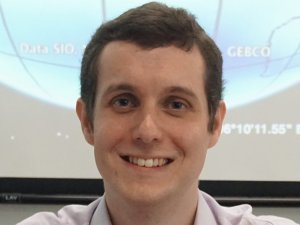

1. [About](#about)
2. [Journal publications](#journal-publications)
3. [Personal](#personal)
4. [Contact](#contact)

## About

I am a climate physicist, modeller, and data scientist. As a **climate physicist**, I seek to understand the physical processes influencing the Earth's climate system. As a **climate modeller**, I use physical climate models and statistical models. As a **climate data scientist**, I analyse and interpret large datasets. My research interests include aerosols, clouds, and sea-level rise. I currently work at [_Nanyang Technological University_](https://www.ntu.edu.sg/spms/about-us/physics/people/research-staff), where I focus on **probabilistic projections of sea-level rise**.

Alongside climate science, I am also interested in Christian **theology**. I find that theology complements science in helping me to understand and respond to the climate crisis. I have explored this theme through articles (for [BioLogos](https://biologos.org/articles/the-beauty-of-climate-science-in-a-broken-world), the [Methodist Message](https://www.methodist.org.sg/methodist-message/christ-centred-creation-care/), and [Salt&Light](https://saltandlight.sg/faith/the-great-commandment-includes-creation-care/)) and talks (including at the [Justice Conference Asia](https://thirst.sg/climate-change-jca-2019/) and a [secondary school](https://youtu.be/5siXD-26v4M)).

## Journal publications

Google Scholar: [https://scholar.google.com/citations?user=NkTkEywAAAAJ](https://scholar.google.com/citations?user=NkTkEywAAAAJ)

Scopus: [https://www.scopus.com/authid/detail.uri?authorId=35221443100#](https://www.scopus.com/authid/detail.uri?authorId=35221443100#)

### Preprints

Grandey, B. S., J. Dauwels, Z. Y. Koh, B. P. Horton, and L. Y. Chew, **Fusion of Probabilistic Projections of Sea-Level Rise**, Preprint at _Research Square_, [doi:10.21203/rs.3.rs-2922142/v3](https://doi.org/10.21203/rs.3.rs-2922142/v3) 

Grandey, B. S., S. Jevrejeva, Z. Y. Koh, B. P. Horton, J. Dauwels, and L. Y. Chew, **Modelling Correlation Among the Ice Sheet Components of Sea-Level Rise**, Preprint at _ESS Open Archive_, [doi:10.22541/essoar.172838599.97774756/v1](https://doi.org/10.22541/essoar.172838599.97774756/v1) 

### 2024

Koh, Z. Y., B. S. Grandey, D. Samanta, A. D. Switzer, B. P. Horton, J. Dauwels, and L. Y. Chew, **Tide–surge interaction observed at Singapore and the east coast of Peninsular Malaysia using a semi-empirical model**, _Ocean Science_, [doi:10.5194/os-20-1495-2024](https://doi.org/10.5194/os-20-1495-2024) 
[PDF](https://os.copernicus.org/articles/20/1495/2024/os-20-1495-2024.pdf)

### 2023

Grandey, B. S., Z. Y. Koh, D. Samanta, B. P. Horton, J. Dauwels, and L. Y. Chew (2023), **Monte Carlo drift correction – quantifying the drift uncertainty of global climate models**, _Geosci. Model Dev._, [doi:10.5194/gmd-16-6593-2023](https://doi.org/10.5194/gmd-16-6593-2023) 
[PDF](https://gmd.copernicus.org/articles/16/6593/2023/gmd-16-6593-2023.pdf)&nbsp; &nbsp; &nbsp; 
[Code](https://github.com/grandey/d22a-mcdc/)

### 2019

Grandey, B. S., and C. Wang (2019), **Background Conditions Influence the Estimated Cloud Radiative Effects of Anthropogenic Aerosol Emissions from Different Source Regions**, _Journal of Geophysical Research: Atmospheres_, [doi:10.1029/2018JD029644](https://doi.org/10.1029/2018JD029644) 
[PDF](https://agupubs.onlinelibrary.wiley.com/doi/epdf/10.1029/2018JD029644)&nbsp; &nbsp; &nbsp; 
[Code](https://github.com/grandey/draft2017a-region-rfp)&nbsp; &nbsp; &nbsp; 
[Data](https://doi.org/10.6084/m9.figshare.6972827)

### 2018

Jin, Q., B. S. Grandey, D. Rothenberg, A. Avramov, and C. Wang (2018), **Impacts on cloud radiative effects induced by coexisting aerosols converted from international shipping and maritime DMS emissions**, _Atmospheric Chemistry and Physics_, [doi:10.5194/acp-18-16793-2018](https://doi.org/10.5194/acp-18-16793-2018) 
[PDF](https://acp.copernicus.org/articles/18/16793/2018/acp-18-16793-2018.pdf)

Grandey, B. S., D. Rothenberg, A. Avramov, Q. Jin, H.-H. Lee, X. Liu, Z. Lu, S. Albani, and C. Wang (2018), **Effective radiative forcing in the aerosol–climate model CAM5.3-MARC-ARG**, _Atmospheric Chemistry and Physics_, [doi:10.5194/acp-18-15783-2018](https://doi.org/10.5194/acp-18-15783-2018) 
[PDF](https://acp.copernicus.org/articles/18/15783/2018/acp-18-15783-2018.pdf)&nbsp; &nbsp; &nbsp;
[Code](https://github.com/grandey/p17c-marc-comparison)&nbsp; &nbsp; &nbsp;
[Data](https://doi.org/10.6084/m9.figshare.5687812)

Grandey, B. S., L. K. Yeo, H.-H. Lee, and C. Wang (2018), **The equilibrium climate response to sulfur dioxide and carbonaceous aerosol emissions from East and Southeast Asia**, _Geophysical Research Letters_, [doi:10.1029/2018GL080127](https://doi.org/10.1029/2018GL080127) 
[PDF](https://agupubs.onlinelibrary.wiley.com/doi/epdf/10.1029/2018GL080127)&nbsp; &nbsp; &nbsp;
[Code](https://github.com/grandey/p17d-sulphur-eas-eqm)&nbsp; &nbsp; &nbsp;
[Data](https://doi.org/10.6084/m9.figshare.6072887)

### 2016

Grandey, B. S., H.-H. Lee and C. Wang (2016), **Radiative effects of interannually varying vs. interannually invariant aerosol emissions from fires**, _Atmospheric Chemistry and Physics_, [doi:10.5194/acp-16-14495-2016](https://dx.doi.org/10.5194/acp-16-14495-2016) 
[PDF](https://acp.copernicus.org/articles/16/14495/2016/acp-16-14495-2016.pdf)&nbsp; &nbsp; &nbsp;
[Data](https://dx.doi.org/10.6084/m9.figshare.3497705)&nbsp; &nbsp; &nbsp;
[MIT News](https://news.mit.edu/2016/climate-models-may-be-overestimating-cooling-effect-of-wildfire-aerosols-1129)

Grandey, B. S., H. Cheng and C. Wang (2016), **Transient climate impacts for scenarios of aerosol emissions from Asia: a story of coal versus gas**, _Journal of Climate_, [doi:10.1175/JCLI-D-15-0555.1](https://dx.doi.org/10.1175/JCLI-D-15-0555.1) 
[PDF](https://journals.ametsoc.org/downloadpdf/journals/clim/29/8/jcli-d-15-0555.1.xml)&nbsp; &nbsp; &nbsp;
[Data](https://dx.doi.org/10.6084/m9.figshare.2067084)&nbsp; &nbsp; &nbsp;
[Video](https://youtu.be/KAwHe3Hu4yw)&nbsp; &nbsp; &nbsp;
[MIT News](https://news.mit.edu/2016/higher-coal-use-asia-could-increase-water-stress-0428)&nbsp; &nbsp; &nbsp;
[Straits Times](https://www.straitstimes.com/singapore/coal-use-can-cause-water-stress-in-asia)

### 2015

Grandey, B. S., and C. Wang (2015), **Enhanced marine sulphur emissions offset global warming and impact rainfall**, _Scientific Reports_, [doi:10.1038/srep13055](https://dx.doi.org/10.1038/srep13055) 
[PDF](https://www.nature.com/articles/srep13055.pdf)&nbsp; &nbsp; &nbsp;
[Data](https://dx.doi.org/10.6084/m9.figshare.1483372)&nbsp; &nbsp; &nbsp;
[Video](https://youtu.be/MM0JaFVDksM)&nbsp; &nbsp; &nbsp;
[MIT News](https://news.mit.edu/2015/fertilize-ocean-cool-planet-0908)&nbsp; &nbsp; &nbsp;
[Straits Times](https://www.straitstimes.com/singapore/shivers-over-growing-plankton-to-cool-earth)

### 2014

Grandey, B. S., A. Gururaj, P. Stier and T. M. Wagner (2014), **Rainfall-aerosol relationships explained by wet scavenging and humidity**, _Geophysical Research Letters_, [doi:10.1002/2014GL060958](https://dx.doi.org/10.1002/2014GL060958) 
[PDF](https://agupubs.onlinelibrary.wiley.com/doi/epdf/10.1002/2014GL060958)&nbsp; &nbsp; &nbsp;
[Data](https://dx.doi.org/10.6084/m9.figshare.1061414)

Gryspeerdt, E., P. Stier and B. S. Grandey (2014), **Cloud fraction mediates the aerosol optical depth – cloud top height relationship**, _Geophysical Research Letters_, [doi:10.1002/2014GL059524](https://dx.doi.org/10.1002/2014GL059524) 
[PDF](https://agupubs.onlinelibrary.wiley.com/doi/epdf/10.1002/2014GL059524)

### 2013

Grandey, B. S., P. Stier, R. G. Grainger and T. M. Wagner (2013), **The contribution of the strength and structure of extratropical cyclones to observed cloud–aerosol relationships**, _Atmospheric Chemistry and Physics_, [doi:10.5194/acp-13-10689-2013](https://dx.doi.org/10.5194/acp-13-10689-2013) 
[PDF](https://acp.copernicus.org/articles/13/10689/2013/acp-13-10689-2013.pdf)

Grandey, B. S., P. Stier and T. M. Wagner (2013), **Investigating relationships between aerosol optical depth and cloud fraction using satellite, aerosol reanalysis and general circulation model data**, _Atmospheric Chemistry and Physics_, [doi:10.5194/acp-13-3177-2013](https://dx.doi.org/10.5194/acp-13-3177-2013) 
[PDF](https://acp.copernicus.org/articles/13/3177/2013/acp-13-3177-2013.pdf)

### 2012

Rowlands, D. J., D. J. Frame, D. Ackerley, T. Aina, B. Booth, C. Christensen, M. Collins, N. Faull, C. E. Forest, B. S. Grandey, E. Gryspeerdt, E. J. Highwood, W. J. Ingram, S. Knight, A. Lopez, N. Massey, F. McNamara, N. Meinshausen, C. Piani, S. M. Rosier, B. M. Sanderson, L. A. Smith, D. A. Stone, M. Thurston, H. Yamazaki, K. Yamazaki and M. R. Allen (2012), **Broad range of 2050 warming from an observationally constrained large climate model ensemble**, _Nature Geoscience_, [doi:10.1038/ngeo1430](https://dx.doi.org/10.1038/ngeo1430) 
[PDF](https://rdcu.be/dbAUK)

### 2011

Grandey, B. S., P. Stier, T. M. Wagner, R. G. Grainger and K. I. Hodges (2011), **The effect of extratropical cyclones on satellite-retrieved aerosol properties over ocean**, _Geophysical Research Letters_, [doi:10.1029/2011GL047703](https://dx.doi.org/10.1029/2011GL047703) 
[PDF](https://agupubs.onlinelibrary.wiley.com/doi/epdf/10.1029/2011GL047703)

### 2010

Grandey, B. S., and P. Stier (2010), **A critical look at spatial scale choices in satellite-based aerosol indirect effect studies**, _Atmospheric Chemistry and Physics_, [doi:10.5194/acp-10-11459-2010](https://dx.doi.org/10.5194/acp-10-11459-2010) 
[PDF](https://acp.copernicus.org/articles/10/11459/2010/acp-10-11459-2010.pdf)

### 2009

Quaas, J., Y. Ming, S. Menon, T. Takemura, M. Wang, J. E. Penner, A. Gettelman, U. Lohmann, N. Bellouin, O. Boucher, A. M. Sayer, G. E. Thomas, A. McComiskey, G. Feingold, C. Hoose, J. E. Kristjánsson, X. Liu, Y. Balkanski, L. J. Donner, P. A. Ginoux, P. Stier, B. Grandey, J. Feichter, I. Sednev, S. E. Bauer, D. Koch, R. G. Grainger, A. Kirkevåg, T. Iversen, Ø. Seland, R. Easter, S. J. Ghan, P. J. Rasch, H. Morrison, J.-F. Lamarque, M. J. Iacono, S. Kinne and M. Schulz (2009), **Aerosol indirect effects — general circulation model intercomparison and evaluation with satellite data**, _Atmospheric Chemistry and Physics_, [doi:10.5194/acp-9-8697-2009](https://dx.doi.org/10.5194/acp-9-8697-2009) 
[PDF](https://acp.copernicus.org/articles/9/8697/2009/acp-9-8697-2009.pdf)

### D.Phil. Thesis

Grandey, B. S. (2011), **Investigating aerosol–cloud interactions**, D.Phil. Thesis, _University of Oxford_, [ora.ox.ac.uk/objects/ora:6053](https://ora.ox.ac.uk/objects/ora:6053) 
[PDF](https://ora.ox.ac.uk/objects/uuid:8b48c02b-3d43-4b04-ae55-d9885960103d/files/mab6487ddeac08577263951844f2939e3)

## Personal
Clothed in rags, filth, dirt and mud, 
A fool in whom there is no good, 
Save that which lavish grace bestows, 
Behold, I stand in royal robes.

He took my sin, he took my shame. 
He washed my fully clean, no stain! 
Restored my honour, now I live, 
My life, my all, to Christ I give.

## Contact

